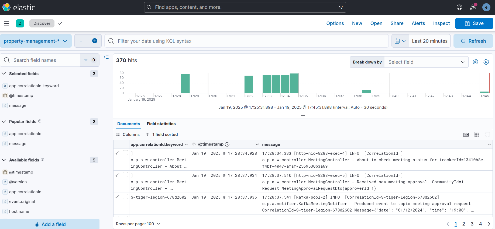
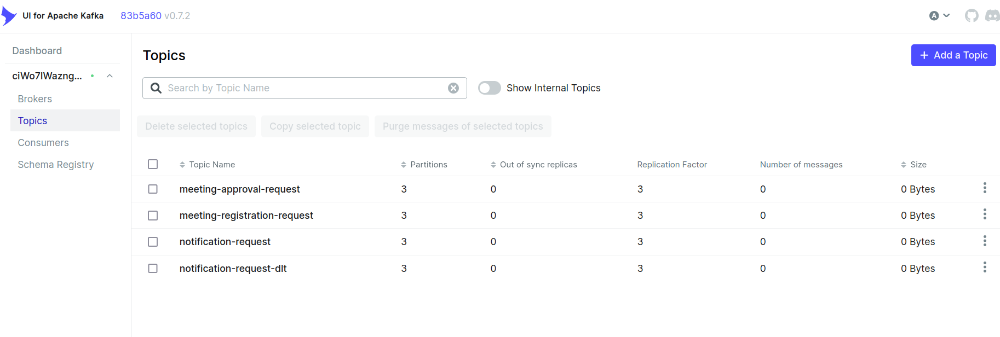
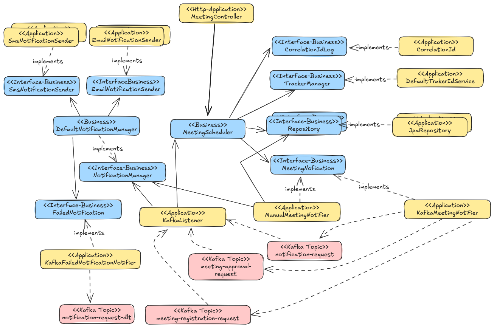

# Kafka cluster
## Commands
### Start up
```
cd property-management
docker-compose -f ./docker/scripts/docker-compose.yml up --remove-orphans
```
Run in detached mode
```
docker-compose -f ./docker/scripts/docker-compose.yml up -d --remove-orphans
```
### Shutdown
```
cd property-management
docker-compose -f ./docker/scripts/docker-compose.yml down --remove-orphans
```

## Create topics
Once the Kafka cluster is running.
```
docker exec -it kafka1 /bin/bash
./create-topics.sh
```
## Logs
```
docker logs --follow kafka1
```

### Volumes for Kafka brokers
```
cd property-management
mkdir -p ./docker/volumes/kafka
chown -R 1000:1000 ./docker/volumes/kafka
```


# TODO: JMeter
```
jmeter -n -t ./jmeter/scripts/property_management_1.jmx -l ./jmeter/log/result_jmeter.csv -j ./jmeter/log/jmeter.log
```

# Flow
## Schedule a new association meeting invite
The schedule meeting approval process in the flow can be either automatic (default behaviour -without requiring 
any manual acceptance of the approval by the community's president) or manual.
Once the meeting is approved the workflow will automatically notify to all community members via e-mail or SMS.
* Property to configure the approval process: `meeting.approval.automatic=true`
Kafka topics used by the application will be automatically created at startup time if `kafka.topic.creation=on`

#### 1. Create a new meeting invite
If the approval is manual, the Community's president will receive an approval notification message via e-mail and/or SMS
* E-mail integration: `email.integration=on`
* SMS integration via Twilio: `sms.twilio.integration=on`
``` 
$ curl -v -H "Content-Type: application/json" -X POST 'http://localhost:8288/communities/1/meetings' -d '{"date":"01/12/2024", "time":"19:00"}'
Note: Unnecessary use of -X or --request, POST is already inferred.
*   Trying 127.0.0.1:8288...
* Connected to localhost (127.0.0.1) port 8288 (#0)
> POST /communities/1/meetings HTTP/1.1
> Host: localhost:8288
> User-Agent: curl/7.81.0
> Accept: */*
> Content-Type: application/json
> Content-Length: 37
> 
* Mark bundle as not supporting multiuse
< HTTP/1.1 201 
< Location: http://localhost:8288/communities/1/trackers/13410b8e-f4bf-4047-afaf-2569530b3a69
< Content-Type: application/json
< Transfer-Encoding: chunked
< Date: Sun, 19 Jan 2025 16:21:51 GMT
< 
* Connection #0 to host localhost left intact
{"status":"MEETING_SCHEDULE_REQUESTED","description":"Association meeting creation has been requested."}
```

### 2. Check current status 
Still not approved (MEETING_SCHEDULE_REQUESTED)
``` 
$ curl -v -H "Content-Type: application/json" -X GET 'http://localhost:8288/communities/1/trackers/13410b8e-f4bf-4047-afaf-2569530b3a69'

Note: Unnecessary use of -X or --request, GET is already inferred.
*   Trying 127.0.0.1:8288...
* Connected to localhost (127.0.0.1) port 8288 (#0)
> GET /communities/1/trackers/13410b8e-f4bf-4047-afaf-2569530b3a69 HTTP/1.1
> Host: localhost:8288
> User-Agent: curl/7.81.0
> Accept: */*
> Content-Type: application/json
> 
* Mark bundle as not supporting multiuse
< HTTP/1.1 200 
< Content-Type: application/json
< Transfer-Encoding: chunked
< Date: Sun, 19 Jan 2025 16:24:04 GMT
< 
* Connection #0 to host localhost left intact
{"date":"01/12/2024","time":"19:00","status":"MEETING_SCHEDULE_REQUESTED","approvalDateTime":null,"description":null}
```

### 3. Approve the new meeting by the president 
``` 
curl -v -H "Content-Type: application/json" -X POST 'http://localhost:8288/communities/1/trackers/13410b8e-f4bf-4047-afaf-2569530b3a69' -d '{"approverId":"1"}'
```
If successful it automatically triggers notifications to each participant.
`{"description":"Association meeting approval has been requested."}`


### 4. Resend schedule meeting to the president (approver) for approval
``` 
curl -v -H "Content-Type: application/json" -X POST 'http://localhost:8288/communities/resendinvite' -d '{"communityId":"1", "trackerId":"13410b8e-f4bf-4047-afaf-2569530b3a69", "action":"FOR_APPROVAL"}'
```
### 5. Resend schedule meeting to meeting participants
``` 
curl -v -H "Content-Type: application/json" -X POST 'http://localhost:8288/communities/resendinvite' -d '{"communityId":"1", "trackerId":"13410b8e-f4bf-4047-afaf-2569530b3a69", "action":"TO_PARTICIPANTS"}'

Note: Unnecessary use of -X or --request, POST is already inferred.
*   Trying 127.0.0.1:8288...
* Connected to localhost (127.0.0.1) port 8288 (#0)
> POST /communities/resendinvite HTTP/1.1
> Host: localhost:8288
> User-Agent: curl/7.81.0
> Accept: */*
> Content-Type: application/json
> Content-Length: 99
> 
* Mark bundle as not supporting multiuse
< HTTP/1.1 200 
< Content-Type: application/json
< Transfer-Encoding: chunked
< Date: Sun, 19 Jan 2025 16:34:56 GMT
< 
* Connection #0 to host localhost left intact
{"description":"Association meeting resend invite has been successful."}
```


# Kibana Query Language (KQL)
`http://localhost:5601`
#### Find all message logs with aggregated CorrelationId=<value> 
`app.correlationId.keyword:* AND NOT app.correlationId.keyword:''`


# Kafka topics
`http://localhost:8080`



# Integrations
## SMS
The application uses Twilio API and its provider. 
The following environment variables must be provided.
```
TWILIO_AUTH_TOKEN=<your_token>
TWILIO_SID=<your_sid>
```
* Enable SMS integration: `sms.twilio.integration=on`
* Disable SMS integration and use stub logic for simulation: `sms.twilio.integration=off`
## E-mail
The application uses Java Spring Mail API and has been tested with Gmail provider.
The following environment variables must be provided.
```
MAIL_PASSWORD=<your_password>
MAIL_USERNAME=<your_username>
```
* Enable e-mail integration: `email.integration=on`
* Disable e-mail integration and use stub logic for simulation: `email.integration=off`

## Database
By default, MySQL is used as database.
In-memory H2 database can be used if the application is started with H2 Spring profile (`-Dspring.profiles.active=h2`)

## Kafka  
Kafka is the integration layer to allow communication between components and services asynchronously.
Events are produced by the application and published into topics to be consumed by the consumers.
* Topics used: `KafkaTopicsConfig.java`
* Topics to be created at startup time: `kafka.topic.creation=on`

## Avro registry
Avro registry keeps track of Kafka message versions defined in avsc files in module property-management-avro-schemas
 
# Testing
## Test SMS and/or E-mail notification errors
Start up the application with local Spring profile (`-Dspring.profiles.active=local`) to enable `/test/notifications` REST endpoint
* Send the notification to the recipients registered. Example: `curl -v -X POST 'http://localhost:8288/test/notifications' -H "Content-Type: application/json" -d '{"notificationType":"MEETING_NOTIFICATION","date":"01/12/2024","time":"19:00","communityId":1,"recipientIds":[1,2,3,4]}'`
* If you want to test errors in the notification delivery, enable errors 
  ```
  test.notification.stub.email.error.enabled=on
  test.notification.stub.sms.error.enabled=on
  ```
* If you want to retry enable via property `notification.retry=on` (`RetryNotificationConfig`)
* if retry SMS: `sms.retries=on`
* if retry E-mail: email.retries=on

# Application architecture
The architecture follows the basic principles of Clean Architecture.

For more details refer to [https://blog.cleancoder.com/uncle-bob/2012/08/13/the-clean-architecture.html]("Clean Architecture")
Main modules:
* property-management-business-core: Property Management business rules like the business domain reusable and technology agnostic.
* property-management-business-app: Specific application business rules, use cases (meetings, notifications, community members).
* property-management-avro-schemas: Avro schemas to be registered in Avro Registry used as a contract for Kafka producers and consumers of events/messages.
* property-management-app: Implementation of adapters for integrations web, database, Kafka, SMS, e-mail, and configuration by using Spring and Spring Boot framework.

Basic application architecture diagram produced with Exalidraw (https://excalidraw.com/)




# Startup the application
`property-management$ ./mvnw -pl property-management-app spring-boot:run`

# Issues
## Elastic search
https://github.com/FusionAuth/fusionauth-containers/issues/20

